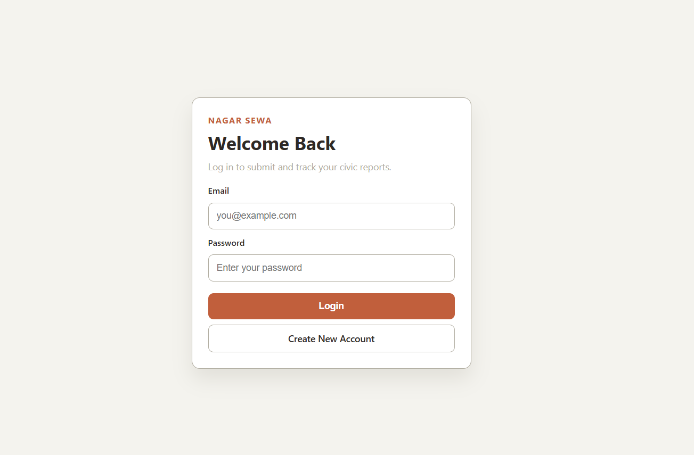
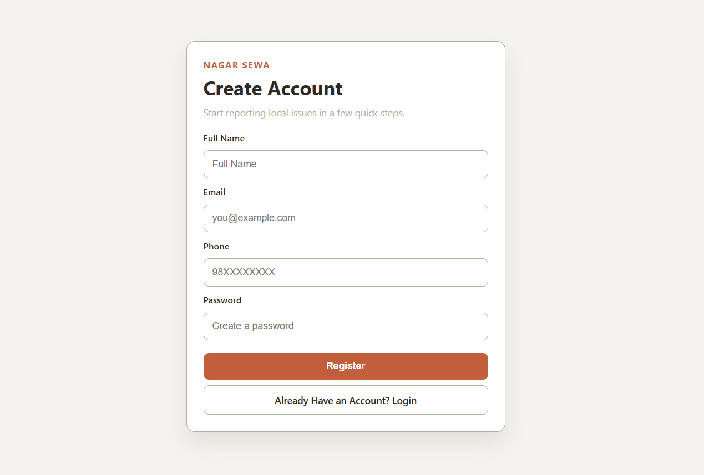
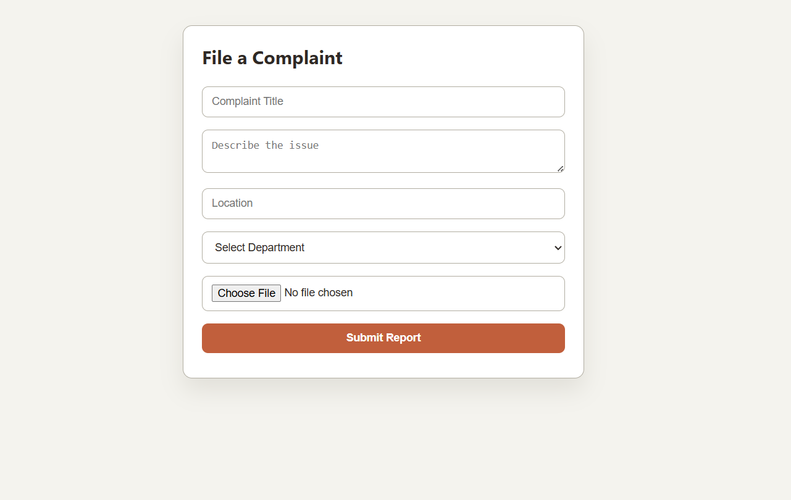
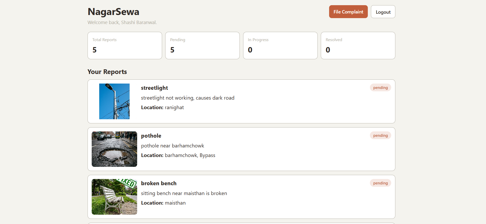

# 🏙️ NagarSewa — Civic Issue Reporting Platform

> **5th Semester Project** — Built as part of the academic curriculum to demonstrate full-stack web development skills using PHP and MySQL.

NagarSewa (नगर सेवा) is a web-based civic issue reporting platform that empowers citizens to report local problems — such as broken roads, water supply failures, and sanitation issues — directly to the relevant municipal departments. The goal is to bridge the gap between citizens and local government bodies by providing a simple, transparent, and accessible complaint filing system.

---

## 📌 Features

- 🔐 **User Authentication** — Secure registration and login with hashed passwords
- 📋 **Complaint Submission** — File civic complaints with title, description, location, department, and an image
- 🖼️ **Image Upload** — Attach photo evidence to each complaint
- 📊 **Personal Dashboard** — View all submitted reports along with their current status (Pending, In Progress, Resolved)
- 🏛️ **Department Routing** — Complaints are routed to the relevant department (Road, Water Supply, Sanitation)
- 🔒 **Session-Based Access Control** — Protected routes ensure only authenticated users can access the dashboard and submit reports

---

## 🖼️ Screenshots

### 🔑 Authentication (Login & Registration)




### 📋 Complaint Registration



### 📊 User Dashboard


---

## 🛠️ Tech Stack

| Layer        | Technology          |
|--------------|---------------------|
| **Frontend** | HTML5, CSS3 (Vanilla) |
| **Backend**  | PHP (Procedural)    |
| **Database** | MySQL               |
| **Server**   | Apache (via Laragon) |
| **Auth**     | PHP Sessions + `password_hash()` / `password_verify()` |

---

## 🗂️ Project Structure

```
nagarSewa/
│
├── index.php               # Entry point — redirects to login
├── login.php               # Login page
├── register.php            # Registration page
├── dashboard.php           # User dashboard (protected)
├── submit.report.php       # Complaint submission form (protected)
├── logout.php              # Session destroy & redirect
│
├── config/
│   └── db.php              # MySQL database connection
│
├── process/
│   ├── login.process.php       # Handles login form POST
│   ├── register.process.php    # Handles registration form POST
│   └── report.process.php      # Handles complaint submission POST
│
├── styles/
│   ├── login.css           # Login page styles
│   ├── register.css        # Register page styles
│   ├── dashboard.css       # Dashboard styles
│   └── submit.report.css   # Complaint form styles
│
└── uploads/                # Uploaded complaint images
```

---

## ⚙️ How It Works

### 1. User Registration
- A new user fills in their **Full Name, Email, Phone,** and **Password** on the registration page.
- The password is securely hashed using PHP's `password_hash()` before being stored in the database.
- The user is then redirected to the login page.

### 2. User Login
- The user submits their email and password.
- The system fetches the matching user from the database and verifies the password using `password_verify()`.
- On success, a PHP session is started and the user is redirected to their personal dashboard.

### 3. Submitting a Complaint
- Authenticated users can file a complaint by providing:
  - **Title** — Short description of the issue
  - **Description** — Detailed explanation
  - **Location** — Where the issue is occurring
  - **Department** — The responsible department (Road, Water Supply, Sanitation)
  - **Image** — A photo of the issue as evidence
- The image is uploaded to the `uploads/` directory and the complaint is stored in the `reports` table in the database.

### 4. Dashboard
- The dashboard fetches all complaints submitted by the logged-in user from the database.
- It displays a **status summary** (Total, Pending, In Progress, Resolved) and a detailed list of each complaint card with its current status.

### 5. Access Control
- All protected pages (`dashboard.php`, `submit.report.php`) check for an active session at the top. If the user is not logged in, they are immediately redirected to `login.php`.
- Already-logged-in users visiting the login or register page are redirected to the dashboard.

---

## 🗃️ Database Schema

### `users` table

| Column     | Type         | Description              |
|------------|--------------|--------------------------|
| `user_id`  | INT (PK, AI) | Unique user identifier   |
| `name`     | VARCHAR      | Full name                |
| `email`    | VARCHAR      | Email (unique)           |
| `password` | VARCHAR      | Bcrypt hashed password   |
| `phone`    | VARCHAR      | Phone number             |
| `role`     | VARCHAR      | User role (default: user)|

### `reports` table

| Column        | Type         | Description                   |
|---------------|--------------|-------------------------------|
| `report_id`   | INT (PK, AI) | Unique report identifier      |
| `user_id`     | INT (FK)     | References `users.user_id`    |
| `dept_id`     | INT (FK)     | References department         |
| `title`       | VARCHAR      | Complaint title               |
| `description` | TEXT         | Detailed description          |
| `location`    | VARCHAR      | Location of the issue         |
| `image`       | VARCHAR      | Path to uploaded image        |
| `status`      | VARCHAR      | Pending / In Progress / Resolved |
| `created_at`  | TIMESTAMP    | Submission timestamp          |

---

## 🚀 Local Setup

> Requires **Laragon** (or any LAMP/WAMP stack) with PHP and MySQL.

1. **Clone or copy** the project into your Laragon `www` directory:
   ```
   C:\laragon\www\nagarSewa\
   ```

2. **Create the database** in phpMyAdmin or MySQL CLI:
   ```sql
   CREATE DATABASE nagarsewa_db;
   ```

3. **Create the tables** using the schema above (or import a provided `.sql` file if available).

4. **Configure the database** in `config/db.php` — update credentials if needed (default uses `root` with no password).

5. **Start Laragon** and visit:
   ```
   http://nagarsewa.test/login.php
   ```
   or
   ```
   http://localhost/nagarSewa/login.php
   ```

---

## 👤 Author

**Shashi Baranwal**
5th Semester — Bachelor's in Computer Science and Information Technology
Academic Year: 2025/26

---

## 📄 License

This project is submitted as an academic project and is intended for educational purposes only.
